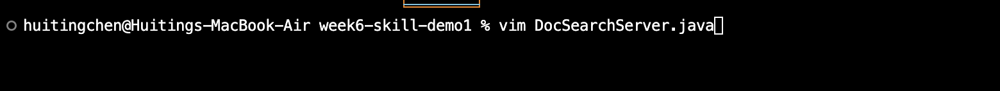
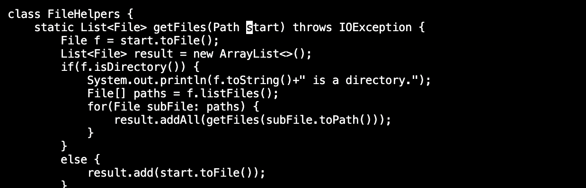
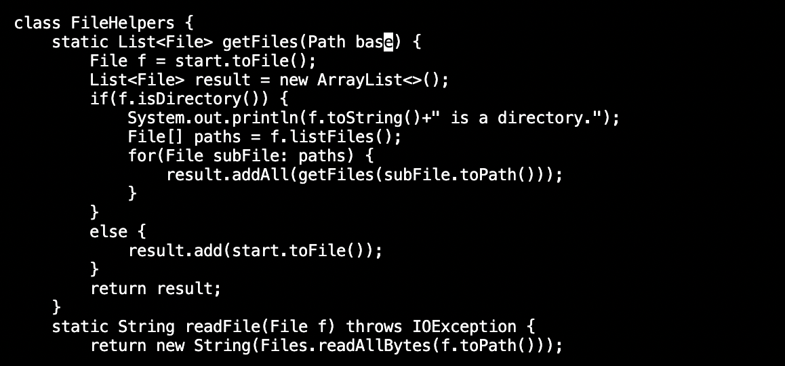
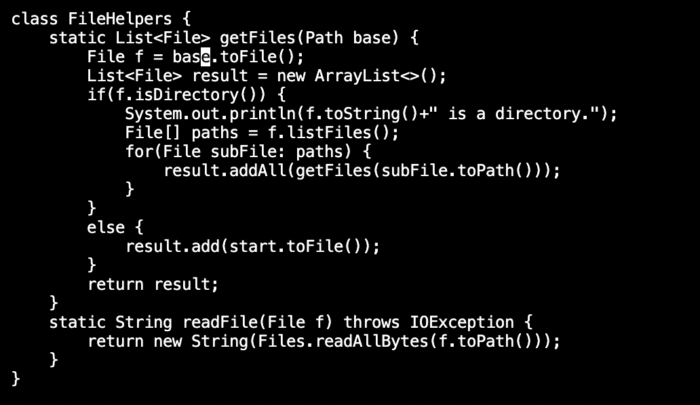
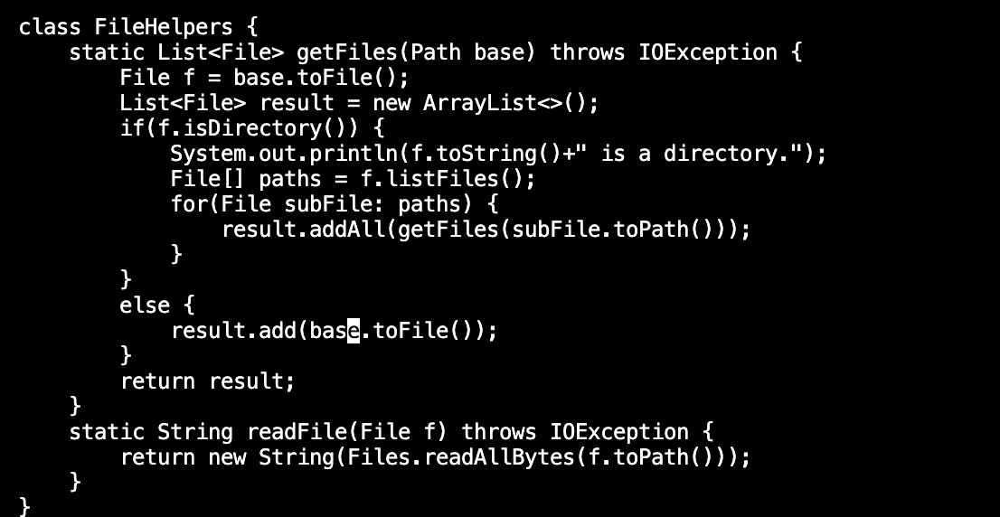
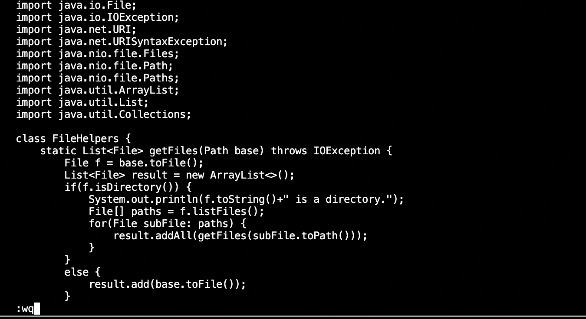

# Week 7 Lab Report
## Part 1
Pick: Changing the name of the start parameter and its uses to base

vim DocSearchServer.java\<Enter\>\
write this to open DocSearchServer.java in the terminal.

/start\<Enter\>\
write this to search for the first start in the DocSearchServer.java

cebase\<Esp>\
delete the start just found and write base in the same place.

n.\
find the next start and repeat the previous operation in insert mode (cebase)

n.\
find the next start and repeat the previous operation in insert mode (cebase)

:wq\<Enter\>\
This is to save the change and quit

## Part 2
The first trail: 71 seconds\
The second trail: 59 seconds\
I can change the content in DocSearchServer.java, but it return an error of "duplicate class" when I try to run it. Later I upload the file to remote device so it can run.\

I prefer to change the program remotely because in this case, I don't need to clone it into my computer and scp the file again. It is much easier.\
I think the amount of work I am going to do will affect my dicision. If there are too many thing to change, then I prefer to do it on local computer so I can see the syntax error labeled in the local computer.